# Clarifying Requirements

Turn vague requests into precise, actionable requirements through structured dialogue.

This skill sits **between** the user's initial request and any design/brainstorming work. It ensures you understand *what* to build before figuring out *how* to build it.

<HARD-GATE>
Do NOT read any code, make any file changes, invoke brainstorming, writing-plans, or any implementation skill until you have:
1. Restated the request and received user confirmation
2. Asked at least one clarifying question and received an answer

Exploration of files is ONLY allowed AFTER initial clarification. During exploration, do NOT plan implementation — only understand what exists.
This applies to EVERY request, regardless of perceived simplicity or time pressure.
</HARD-GATE>

## Anti-Pattern: "I Know What They Want, No Need To Clarify"

Every request goes through this process. A one-liner, a bug report, a feature ask — all of them. The clarification can be brief (a few questions for truly simple requests), but you MUST go through it and produce a written requirements document.

**CRITICAL: Do NOT read any code or explore the codebase until AFTER you have asked at least one clarifying question and received an answer.** File exploration is for refining your understanding of WHAT exists, not for planning HOW to change it. If you find yourself thinking "I should change X in file Y" during exploration, you have moved too fast.

**Violating the letter of the rules is violating the spirit of the rules.**

## Checklist

You MUST create a task for each of these items and complete them in order:

1. **Restate the request** — paraphrase what you heard, confirm understanding
2. **Ask clarifying questions** — group by category (purpose, constraints, scope, success criteria, audience), ask all questions in the same category together. Each question MUST provide 2-3 concrete options, with one marked as **Recommended** and include the reasoning why. MUST ask at least one question before reading any code.
3. **Explore current context** — AFTER initial clarification, check relevant files/docs to refine your understanding
4. **Ask follow-up questions** — use what you found to ask better questions
5. **Identify edge cases** — what happens at boundaries, what's explicitly out of scope
6. **Define success criteria** — how will we know this is done and working correctly
7. **Write requirements doc** — save to `docs/superpowers/requirement/YYYY-MM-DD-<topic>-requirement.md` and commit
8. **Requirements self-review** — quick inline check for placeholders, ambiguity, scope creep (see below)
8b. **Subagent review** — dispatch reviewer subagent, fix any issues found (see below)
9. **User reviews written requirements** — ask user to review before any design work
10. **Transition to brainstorming** — invoke brainstorming skill to explore design approaches

## Process Flow

```dot
digraph clarifying_requirements {
    rankdir=LR;
    "Restate request" [shape=box];
    "Round 1: Purpose & Audience" [shape=box];
    "User answered?" [shape=diamond];
    "Round 2: Scope" [shape=box];
    "Round 3: Constraints" [shape=box];
    "Round 4: Success criteria" [shape=box];
    "Explore context" [shape=box];
    "Follow-up questions" [shape=box];
    "Identify edge cases" [shape=box];
    "Write requirements doc" [shape=box];
    "Self-review" [shape=box];
    "Subagent review?" [shape=diamond];
    "User reviews?" [shape=diamond];
    "Invoke brainstorming" [shape=doublecircle];

    "Restate request" -> "Round 1: Purpose & Audience";
    "Round 1: Purpose & Audience" -> "User answered?";
    "User answered?" -> "Round 1: Purpose & Audience" [label="no, ask more"];
    "User answered?" -> "Round 2: Scope" [label="yes"];
    "Round 2: Scope" -> "Round 3: Constraints";
    "Round 3: Constraints" -> "Round 4: Success criteria";
    "Round 4: Success criteria" -> "Explore context";
    "Explore context" -> "Follow-up questions";
    "Follow-up questions" -> "Identify edge cases";
    "Identify edge cases" -> "Write requirements doc";
    "Write requirements doc" -> "Self-review";
    "Self-review" -> "Subagent review?";
    "Subagent review?" -> "Write requirements doc" [label="issues found"];
    "Subagent review?" -> "User reviews?" [label="approved"];
    "User reviews?" -> "Write requirements doc" [label="changes requested"];
    "User reviews?" -> "Invoke brainstorming" [label="approved"];
}
```



**The terminal state is invoking brainstorming.** Do NOT invoke writing-plans or any implementation skill directly. The ONLY next step after clarifying-requirements is brainstorming.

## The Process

**Restating the request:**

- Paraphrase what you understood in your own words
- Ask the user: "Just to make sure I understand — you want X so that Y. Is that right?"
- If the user corrects you, restate again until aligned

**Exploring context:**

- This step happens AFTER initial clarifying questions, not before.
- Check relevant files, docs, recent commits related to the request.
- Understand what currently exists before clarifying what should change.
- If the request touches existing code, understand its current behavior and limitations.
- **Do NOT plan changes during exploration.** If you catch yourself thinking "I should modify X" or "the fix is Y," stop. That is implementation planning, which comes after requirements are clarified.
- **Do NOT make any file changes.** Read-only during this phase.

**Asking clarifying questions:**

- **Group by category** — ask all questions in the same category together in one round. Categories: **purpose** (why), **constraints** (what limits exist), **scope** (what's in/out), **success criteria** (how we know it's done), **audience** (who is this for)
- Round 1: Purpose & Audience questions → Round 2: Scope questions → Round 3: Constraints questions → Round 4: Success criteria questions
- **Each question MUST present 2-3 concrete options** (A, B, C) with one marked as **⭐ Recommended** and include the reasoning why. This gives the user a starting point while making tradeoffs visible.
- Options should represent meaningfully different approaches, not trivial variations. Each option should make a different tradeoff visible (simplicity vs power, speed vs quality, breadth vs depth).
- Prefer multiple choice format; use open-ended only when you genuinely cannot enumerate reasonable options
- Each round should contain 2-5 related questions presented together, not one at a time
- If the request describes multiple independent features, flag this immediately. Don't refine details of a project that needs decomposition first.
- For large requests, help decompose into sub-requirements. Each sub-requirement can get its own clarification cycle.

**Good clarifying question examples (grouped by category, 2-3 options each):**

```
=== Round 1: Purpose & Audience ===

Q1: What problem are you trying to solve?
  Context: "I want to add caching to the API"

  A) Reduce database load — the DB is the bottleneck, queries are expensive
  B) Reduce API latency — users are complaining about slow responses
  C) Reduce infrastructure cost — we're over-provisioned and need to scale down

  ⭐ Recommended: B — Reduce API latency
  → Why: Most teams saying "add caching" are responding to user-facing slowness. If the real
    driver is DB load (A) or cost (C), the caching strategy changes significantly — DB-focused
    caching goes at the query layer, while latency-focused caching goes at the response layer.
    Which of these best describes your situation?

Q2: Who is the primary user of this feature?
  Context: "The admin panel needs an export button"

  A) Internal ops team — 5-10 people, technical, need raw data for analysis
  B) Customer support — 50+ people, semi-technical, need formatted reports for customers
  C) End customers — self-service, non-technical, need polished PDF/CSV downloads

  ⭐ Recommended: A — Internal ops team
  → Why: Admin panels are typically used by internal teams with higher trust levels. UX polish
    matters less, raw data formats (CSV/JSON) are preferred. If it's customer-facing (C), the
    export format and error handling need significantly more investment. Who's the audience?

=== Round 2: Scope ===

Q3: What scope makes sense for the first version?
  Context: "Build a dashboard"

  A) Minimal: 3-5 core metrics, single page, read-only — ship in 1 week
  B) Standard: 8-12 metrics, 2-3 pages with filters, basic drill-down — ship in 2-3 weeks
  C) Full: 20+ metrics, multi-page with custom date ranges, export, alerts — ship in 4-6 weeks

  ⭐ Recommended: A — Minimal (3-5 core metrics)
  → Why: Dashboards that show everything become noise. Starting with 3-5 metrics that answer
    the most common operational questions gives fast delivery, real user feedback, and clear
    direction for what to add next. What metrics must be in v1? What can wait?

Q4: How should we phase the features mentioned?
  Context: "User profiles with avatars, bios, settings, notification preferences, activity history"

  A) Single phase: build everything at once
  B) Two phases: Phase 1 = profiles + avatars + bios. Phase 2 = settings + notifications + history
  C) Three phases: Phase 1 = profiles + avatars + bios. Phase 2 = settings + notifications.
     Phase 3 = activity history

  ⭐ Recommended: C — Three phases
  → Why: Profiles with basic info deliver immediate value and unblock other features. Settings
    and notifications are complex subsystems that benefit from real usage data. Activity history
    likely depends on events we may not be emitting yet. Which phasing feels right?

=== Round 3: Constraints ===

Q5: What's the acceptable latency for sync?
  Context: "We need real-time sync"

  A) True real-time (<50ms) — requires WebSocket infrastructure, operational complexity high
  B) Near-real-time (<500ms) — polling or SSE, covers most collaborative editing use cases
  C) Eventually consistent (<5s) — simplest to build, acceptable for non-collaborative use

  ⭐ Recommended: B — Near-real-time (<500ms)
  → Why: True real-time requires significant infrastructure investment and is rarely necessary.
    <500ms with polling or SSE covers virtually all "real-time" requirements at a fraction of
    the complexity. Only go for A if you're building Google Docs-style simultaneous editing.
    What's your use case?

Q6: What's the timeline and who's available?
  Context: "Make the search faster"

  A) Quick win (1-3 days): add database indexes, basic query optimization — one dev
  B) Moderate effort (1-2 weeks): add caching layer, optimize queries, tune relevance — one dev
  C) Major investment (4-8 weeks): migrate to Elasticsearch, full-text search, faceting — team

  ⭐ Recommended: B — Moderate effort (1-2 weeks)
  → Why: Most "search is slow" problems come from missing indexes or unoptimized queries (A),
    but once those are exhausted, a caching layer and relevance tuning (B) provide substantial
    gains. Full Elasticsearch migration (C) is a multi-month project — only worth it if search
    is a core product feature. What's your timeline and team capacity?

=== Round 4: Success Criteria ===

Q7: How will we know this is done and working?
  Context: "Make it faster"

  A) Specific latency target: p95 <200ms page load, p99 <500ms under 1000 concurrent users
  B) Relative improvement: 2x faster than current, measured by the same benchmark
  C) Qualitative: "feels snappy," no user complaints about speed in the first week post-launch

  ⭐ Recommended: A — Specific latency target
  → Why: "Faster" without a number is impossible to verify. A concrete p95/p99 target under
    defined load gives everyone the same definition of done. If you don't have current baselines,
    start with B (measure now, target 2x) and set A once you have data. What does "fast enough"
    look like?

Q8: What would make you say "this is not what I wanted"?
  Context: setting failure expectations upfront

  A) Doesn't solve the core problem we identified — the pain point remains
  B) Too complex to use — adds friction instead of removing it
  C) Breaks existing workflows — the cure is worse than the disease

  ⭐ Recommended: A — Doesn't solve the core problem
  → Why: The most common failure mode is building something that's technically correct but
    doesn't address the actual pain point. The other two (B and C) are about execution quality.
    Understanding which failure you fear most shapes how we validate the solution.
    Which outcome worries you most?
```

**Identifying edge cases:**

- What happens at boundaries? (empty input, max input, concurrent access)
- What error conditions matter? (network failure, invalid data, timeouts)
- What's explicitly out of scope? (what should we NOT build even if it seems related)

**Defining success criteria:**

- Concrete, measurable outcomes
- "It works" is not a success criterion
- "API responds in <200ms at p99 under 1000 req/s" is a success criterion

## After Clarification

**Documentation:**

- Write the validated requirements to `docs/superpowers/requirement/YYYY-MM-DD-<topic>-requirement.md`
  - (User preferences for requirement location override this default)
- Use elements-of-style:writing-clearly-and-concisely skill if available
- Commit the requirements document to git

**Requirements Document Structure:**

```markdown
# Requirements: <Topic>

## Background
What problem are we solving and why now?

## Goals
What must this achieve? (numbered, specific, measurable)

## Non-Goals
What are we explicitly NOT doing?

## Scope
What's included and what's excluded?

## Constraints
Technical, business, or time constraints.

## Success Criteria
How do we know this is done and working? (measurable)

## Edge Cases
Known edge cases and how they should be handled.

## Open Questions
Anything still undecided (minimize these).
```

**Requirements Self-Review:**
After writing the requirements document, look at it with fresh eyes:

1. **Placeholder scan:** Any "TBD", "TODO", incomplete sections, or vague requirements? Fix them.
2. **Internal consistency:** Do any sections contradict each other? Do the goals match the success criteria?
3. **Scope check:** Is this focused enough, or does it need decomposition?
4. **Ambiguity check:** Could any requirement be interpreted two different ways? If so, pick one and make it explicit.
5. **Measurability check:** Can each success criterion be verified with a yes/no or a number? If not, make it measurable.

Fix any issues inline. No need to re-review — just fix and move on.

**Subagent Review:**
After the self-review passes, dispatch a requirements reviewer subagent:

> "Requirements written and self-reviewed. Dispatching reviewer subagent for independent check."

Use the prompt template from `requirements-document-reviewer-prompt.md`. Replace `[REQUIREMENTS_FILE_PATH]` with the actual path to the requirements document.

If the reviewer finds issues, fix them inline and re-run the self-review. If the reviewer approves, proceed to user review.

**User Review Gate:**
After the self-review passes, ask the user to review the written requirements before proceeding:

> "Requirements written and committed to `<path>`. Please review and confirm these capture what you want before we move to exploring design approaches."

Wait for the user's response. If they request changes, make them and re-run the self-review. Only proceed once the user approves.

**Implementation:**

- Invoke the brainstorming skill to explore design approaches
- Do NOT invoke any other skill. brainstorming is the next step.

## Key Principles

- **Group by category** — Same-type questions in one round: purpose first, then scope, then constraints, then success criteria
- **2-3 options per question** — Every question presents A/B/C choices representing different tradeoffs. Never ask open-ended when options can be enumerated.
- **Recommend with reasoning** — Exactly one option marked ⭐ Recommended with clear reasoning. Don't just ask, guide.
- **Focus on WHAT, not HOW** — Requirements describe what to achieve, not how to achieve it
- **Measurable criteria** — Every requirement must be verifiable
- **Explicit non-goals** — What we're NOT building is as important as what we are
- **YAGNI ruthlessly** — Remove unnecessary requirements from scope
- **Be flexible** — Go back and clarify when something doesn't make sense

## Common Mistakes

| Mistake | Fix |
|---------|-----|
| Jumping to solutions | Ask "what problem does this solve?" instead of "which library should we use?" |
| Assuming constraints | Ask about limits explicitly (time, budget, performance) |
| Vague success criteria | Replace "it should work" with specific, measurable outcomes |
| Skipping non-goals | Always define what's out of scope to prevent creep |
| Asking questions without recommendations | Every question should include 2-3 options with one marked ⭐ Recommended + reasoning |
| Asking open-ended when options exist | Enumerate the real choices. "What should we do?" → "Here are the 3 viable approaches..." |
| Only giving one option (false choice) | Always provide 2-3 meaningfully different options. One option is not a choice. |
| Mixing unrelated question types in one round | Group by category — don't ask a scope question and a constraints question together |
| Requirements that prescribe implementation | "The system shall use Redis" → "The system shall cache responses with <50ms latency" |

## Common Rationalizations

| Excuse | Reality |
|--------|---------|
| "I'll explore the code first, then implement" | Exploring is fine, but exploring WITH the intent to implement skips clarification. Explore to understand context, then clarify requirements. |
| "The user is in a hurry / has a meeting / needs this now" | Time pressure is exactly when clarification matters most. A 5-minute clarification saves 30 minutes of wrong implementation. |
| "They expect work to have started" | "Started" means clarifying requirements, not writing code. Clarification IS the first step of work. |
| "I already know what they mean" | You know what you think they mean. Paraphrase and confirm — if you're right, it takes 10 seconds. If you're wrong, it saves hours. |
| "I'll clarify while implementing" | That's not clarification, that's guessing. Clarification happens BEFORE implementation. |
| "This is simple enough, no need to document" | Simple requests often hide complex assumptions. Write the requirements — even if brief. |
| "I'll schedule a deeper discussion later" | There is no "later." Clarify NOW, before any implementation planning. |
| "The real problem is X, not what they asked" | You might be right. But confirm with the user before solving a different problem than they asked for. |
| "I found the problem while reading the code, let me fix it" | Finding a problem is not authorization to fix it. Clarify with the user first. |
| "I have a good idea from exploring, let me propose solutions" | Solutions come after requirements, not during exploration. Ask clarifying questions first. |
| "The user knows more than me, I shouldn't recommend" | You bring broad technical knowledge the user may not have. Your recommendation provides a starting point, even if they disagree. Asking without recommending is lazy, not respectful. |
| "Grouping questions will overwhelm the user" | Related questions asked together reduce cognitive load — the user stays in one mental context. Scattered single questions force constant context-switching. |
| "I don't know enough to recommend" | Make your best guess based on common patterns. If you're wrong, the user will correct you, and you'll learn. That's faster than open-ended exploration. |
| "The answer is obvious, one option is enough" | One option is not a choice — it's a leading question. Always provide 2-3 options so the user can see the tradeoffs and make an informed decision. |
| "I can't think of other options" | If you can only think of one approach, you haven't thought hard enough. Every decision has tradeoffs — enumerate them as options. Start with: simplest, most common, most powerful. |

## Red Flags - STOP and Start Over

- Reading code before asking any clarifying questions
- Making file changes before the requirements document is written and approved
- "They're in a hurry" as justification to skip clarification
- "I'll ask questions later" or "I'll clarify while building"
- Planning implementation during file exploration
- Writing a plan without a requirements document first
- "The problem is obviously X" without confirming with the user
- "I found the issue, let me fix it" before clarifying scope
- Thinking about WHICH files to change before knowing WHAT to build
- Asking questions without providing recommended answers
- Asking open-ended questions when 2-3 concrete options could be enumerated
- Providing only one option (that's not a question, that's a leading statement)
- "The user knows better, I shouldn't bias them with recommendations"
- Asking one question at a time when others in the same category remain unanswered
- Mixing scope, constraints, and success criteria questions in the same round

**All of these mean: Stop. Restate the request. Ask clarifying questions grouped by category, with 2-3 options and a ⭐ Recommended choice.**

## Relationship to Other Skills

```
User Request → clarifying-requirements → brainstorming → writing-plans → executing-plans
   (WHAT)           (clarify)            (HOW)         (steps)       (build)
```

- **clarifying-requirements**: What are we building and why? (this skill)
- **brainstorming**: How should we design it? (explores approaches)
- **writing-plans**: What are the implementation steps? (creates task list)
- **executing-plans**: Build it step by step (implementation)

Each skill has a distinct purpose. Don't skip steps.
